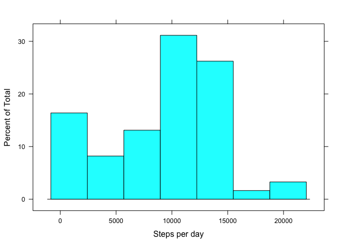
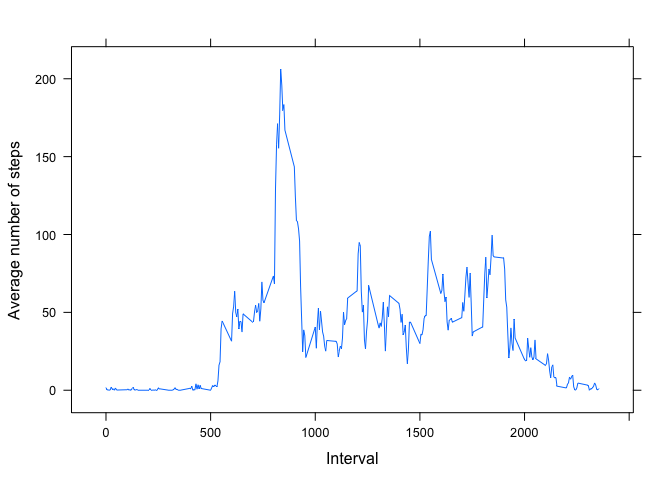
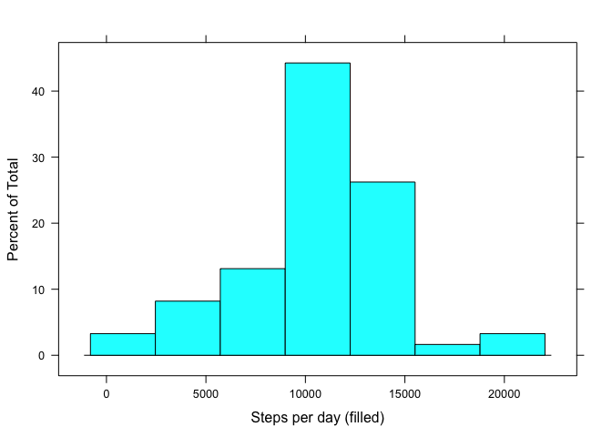

# Reproducible Research: Peer Assessment 1

This project uses data from a personal activity monitoring device. This device collects data at 5 minute intervals through out the day. The data consists of two months of data from an anonymous individual collected during the months of October and November, 2012 and include the number of steps taken in 5 minute intervals each day.

The data is included in the [github project](https://github.com/jvanoosten/RepData_PeerAssessment1) which was forked from [Professor Peng's github probject](https://github.com/rdpeng/RepData_PeerAssessment1).

The variables included in this dataset are:

    steps: Number of steps taking in a 5-minute interval (missing values are coded as NA)

    date: The date on which the measurement was taken in YYYY-MM-DD format

    interval: Identifier for the 5-minute interval in which measurement was taken

The dataset is stored in a comma-separated-value (CSV) file and there are a total of 17,568 observations in this dataset.

## Loading and preprocessing the data

The code below sets the working directory to the git clone of the project, then unzips the dataset if necessary and loads the data into a dataframe called activity using read.csv(). 


```r
  # set the working directory to the RepData_PeerAssessment1 git clone
  setwd("~/Documents/coursera/datascience/reproducible_research/RepData_PeerAssessment1")

  # Verify the activity.zip has been unzipped
  if (!file.exists("activity.csv")) {
    unzip("activity.zip")
    date() # log when the date was extracted
  }
```

```
## [1] "Sat Sep 19 22:28:02 2015"
```

```r
  # load the data
  activity <- read.csv("activity.csv")
```


## What is mean total number of steps taken per day?

The acitivity data is grouped by date and the steps are summed to get the total number of steps taken per day.  The missing values in the dataset are ignored.  The total number of steps taken each day is shown in a histogram.


```r
  # use the dplyr package for arranging, grouping, and summarising the data 
  require("dplyr")
```

```
## Loading required package: dplyr
## 
## Attaching package: 'dplyr'
## 
## The following objects are masked from 'package:stats':
## 
##     filter, lag
## 
## The following objects are masked from 'package:base':
## 
##     intersect, setdiff, setequal, union
```

```r
  library(dplyr)
  # use the lattic package for plotting
  require("lattice")
```

```
## Loading required package: lattice
```

```r
  library(lattice)

  # group the steps by day and get the sum total for each day, ignoring missing (NA) data
  stepsperday <- activity %>% group_by(date) %>% summarise(stepsum = sum(steps , na.rm = TRUE))
  # plot a histogram of total steps taken each day
  histogram(stepsperday$stepsum, xlab="Steps per day")
```

 

The mean and median of the total number of steps taken per day is calculated and reported.


```r
  # get the mean number of steps per day
  mean(stepsperday$stepsum)
```

```
## [1] 9354.23
```

```r
  # get the median number of steps per day
  median(stepsperday$stepsum)
```

```
## [1] 10395
```


## What is the average daily activity pattern?

A time series plot (i.e. type = "l") of the 5-minute interval (x-axis) and the average number of steps taken, averaged across all days (y-axis) is used to show the average daily pattern?


```r
  # group the steps by interval and summarise the mean for each, ignoring missing (NA) data
  stepsperinterval <- activity %>% group_by(interval) %>% summarise(stepmean = mean(steps , na.rm = TRUE))
  # time series plot
  xyplot(stepmean ~ interval, data=stepsperinterval, type="l", xlab="Interval", ylab="Average number of steps")
```

 

The 5-minute interval that contains the maximum number of steps is found by using a row filter that matches the maximum step average.


```r
  filter(stepsperinterval, stepmean == max(stepsperinterval$stepmean))$interval
```

```
## [1] 835
```

## Imputing missing values

There are a number of days/intervals that have missing values (coded as NA).   


```r
  # calculate and report the number of missing values
  missing <- is.na(activity$steps)
  sum(missing)
```

```
## [1] 2304
```

Since the presence of missing values may introduce bias into some calculations or summaries of the data, the missing values are filled in using the mean for that 5-minute interval. 


```r
  # Create a new dataset that is equal to the original 
  activityfilled <- activity
  # replace the NA with the mean for that 5-minute interval.
  activityfilled$steps[missing] <- rep(stepsperinterval$stepmean, 61)[missing]
```

A histogram of the total number of steps taken each day is shown for the filled in dataset. 


```r
  # group the steps by day and get the sum total for each day
  stepsperdayfilled <- activityfilled %>% group_by(date) %>% summarise(stepsum = sum(steps))
  # plot a histogram of total steps taken each day
  histogram(stepsperdayfilled$stepsum, xlab="Steps per day (filled)")
```

 

The histogram differs from the one created with the missing values removed.  The new distribution is more normalized with the middle range showing a higher percent of the total.  

The mean and median total number of steps taken per day are shown for the filled in dataset. 


```r
  # get the mean number of steps per day
  mean(stepsperdayfilled$stepsum)
```

```
## [1] 10766.19
```

```r
  # get the median number of steps per day
  median(stepsperdayfilled$stepsum)
```

```
## [1] 10766.19
```

These values differ from the estimates from the first part of the assignment.  Imputing missing data resulted in an increase on the estimates of the total daily number of steps.  Both the mean and medium values saw increases.


## Are there differences in activity patterns between weekdays and weekends?

Using the dataset with the missing values filled in, a new factor variable (daytype) is created with two levels – “weekday” and “weekend” indicating whether a given date is a weekday or weekend day.


```r
  # the weekend includes Saturday and Sunday
  weekend<- c('Saturday', 'Sunday')
  activityfilled$daytype <- factor((weekdays(as.Date(activityfilled$date)) %in% weekend), levels=c(FALSE, TRUE), labels=c('weekday', 'weekend'))
```

The weekend and weekday steps are compared by making a panel plot that contains a time series plot (i.e. type = "l") of the 5-minute interval (x-axis) and the average number of steps taken, averaged across all weekday days or weekend days (y-axis). 


```r
  stepsperdaytype <- activityfilled %>% group_by(interval, daytype) %>% summarise(stepmean = mean(steps))
  xyplot(stepmean ~ interval | daytype, data=stepsperdaytype, type="l", xlab="Interval", ylab="Number of steps", layout = c(1, 2))
```

 

The weekend shows a higher level of steps through the day.  The weekday does have a higher step peak but step activity drops off after that. 
